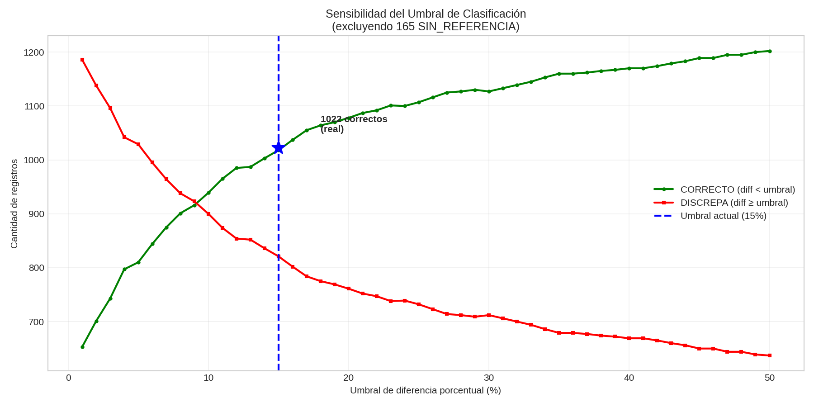
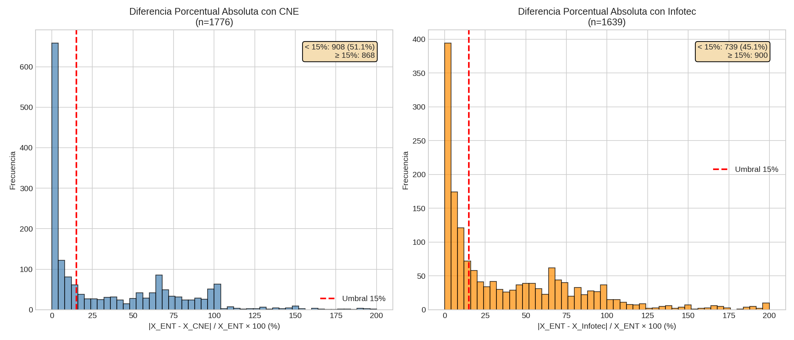
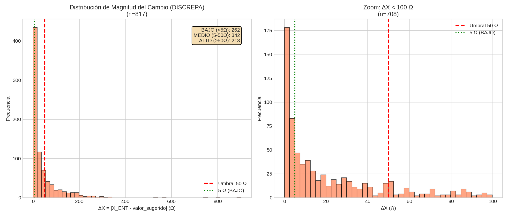
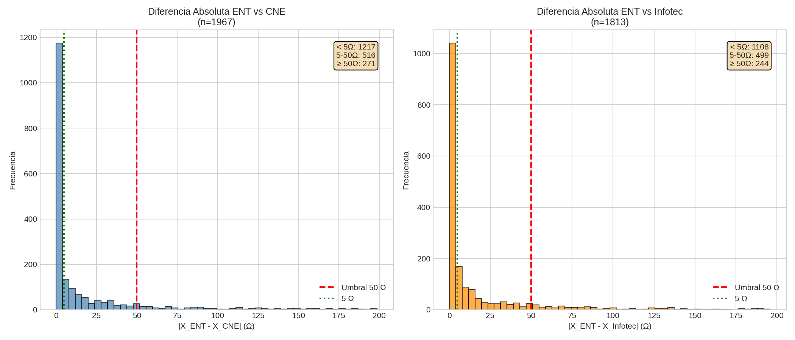
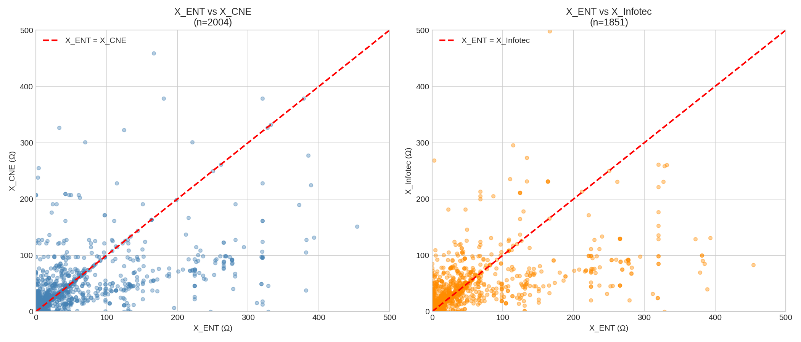
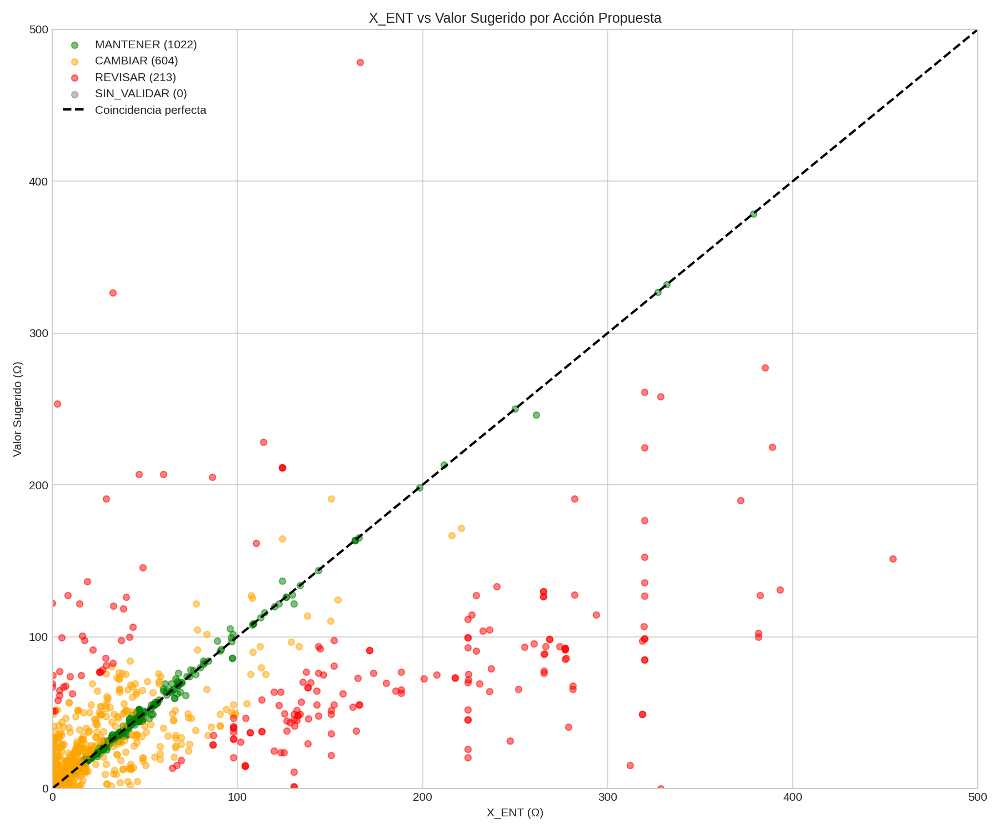
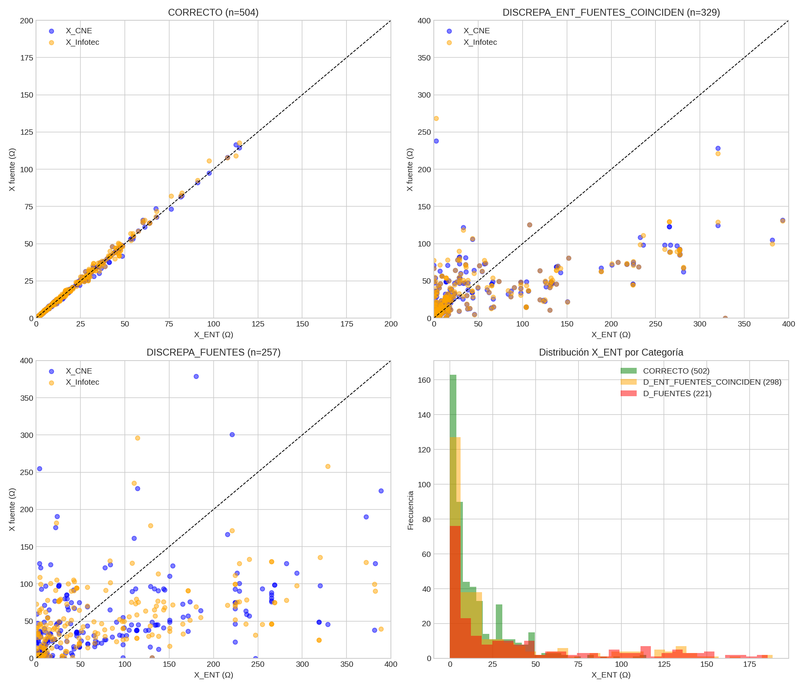
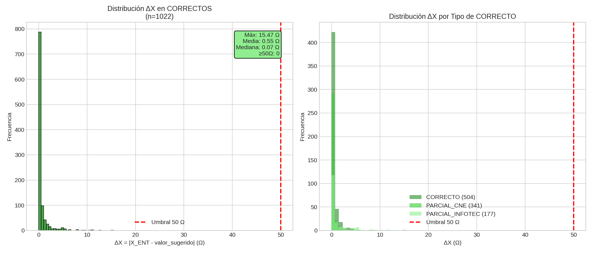
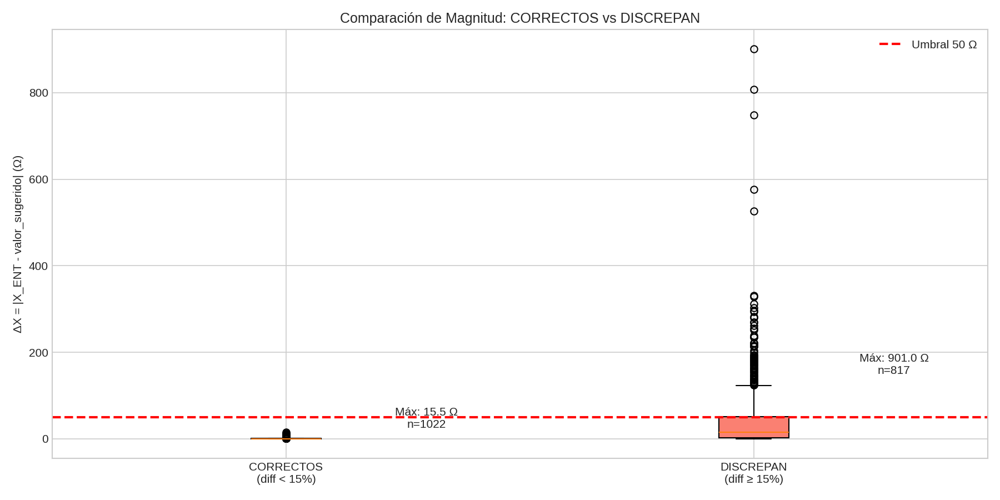

# Validación de Reactancia (X) ENT

Este documento describe la estrategia de validación de los valores de reactancia (X) de la base ENT, comparándolos con las fuentes CNE e Infotécnica.

## Objetivo

Identificar si los valores de X_ENT son correctos o presentan discrepancias respecto a las fuentes de referencia (CNE e Infotécnica).

## Umbrales Elegidos

| Umbral | Valor | Acción |
|--------|-------|--------|
| **Diferencia porcentual** | **15%** | < 15% → CORRECTO, ≥ 15% → DISCREPA |
| **Magnitud del cambio** | **50 Ω** | < 50 Ω → CAMBIAR, ≥ 50 Ω → REVISAR |

---

# Clasificación de Validación (columna `clasificacion_validacion`)

## Columna `revision` (entrada)

La columna `revision` del archivo de homologación indica qué fuentes son confiables:

| Valor | Significado | Cantidad |
|-------|-------------|----------|
| `1` | Ambas fuentes (CNE e Infotec) son confiables | 1410 |
| `CNE` | Solo CNE es confiable | 246 |
| `Infotec` | Solo Infotec es confiable | 195 |
| `0` | Ninguna fuente es confiable | 153 |

**Nota:** Si `revision=1` pero falta `X_Infotec`, se trata como `revision=CNE`. Lo mismo aplica inversamente.

## Categorías de Validación (salida)

### Categorías CORRECTO (X_ENT validado)

| Categoría | Descripción |
|-----------|-------------|
| `CORRECTO` | Ambas fuentes coinciden con X_ENT (diff < 15%) |
| `CORRECTO_PARCIAL_CNE` | Solo CNE disponible/confiable, coincide con X_ENT (diff < 15%) |
| `CORRECTO_PARCIAL_INFOTEC` | Solo Infotec disponible/confiable, coincide con X_ENT (diff < 15%) |

### Categorías DISCREPA (X_ENT con problemas)

| Categoría | Descripción |
|-----------|-------------|
| `DISCREPA_ENT_FUENTES_COINCIDEN` | CNE ≈ Infotec (coinciden entre sí), pero ambas difieren de X_ENT |
| `DISCREPA_FUENTES` | CNE ≠ Infotec (no coinciden entre sí), y ninguna coincide con X_ENT |
| `DISCREPA_PARCIAL_CNE` | Solo CNE disponible/confiable, difiere de X_ENT (diff ≥ 15%) |
| `DISCREPA_PARCIAL_INFOTEC` | Solo Infotec disponible/confiable, difiere de X_ENT (diff ≥ 15%) |

### Sin Referencia

| Categoría | Descripción |
|-----------|-------------|
| `SIN_REFERENCIA` | No hay fuente confiable para comparar (revision=0 o fuente sin valor X) |

## Tabla Resumen (umbral 15%)

| Categoría | Cantidad | % |
|-----------|----------|---|
| `CORRECTO` | 512 | 25.5% |
| `CORRECTO_PARCIAL_CNE` | 341 | 17.0% |
| `CORRECTO_PARCIAL_INFOTEC` | 177 | 8.8% |
| `DISCREPA_ENT_FUENTES_COINCIDEN` | 323 | 16.1% |
| `DISCREPA_FUENTES` | 255 | 12.7% |
| `DISCREPA_PARCIAL_CNE` | 139 | 6.9% |
| `DISCREPA_PARCIAL_INFOTEC` | 92 | 4.6% |
| `SIN_REFERENCIA` | 165 | 8.2% |
| **Total** | **2004** | **100%** |

**Resumen:**
- **Correctos:** 1030 (51.4%) → `CORRECTO` + `CORRECTO_PARCIAL_CNE` + `CORRECTO_PARCIAL_INFOTEC`
- **Discrepan:** 809 (40.4%) → `DISCREPA_ENT_FUENTES_COINCIDEN` + `DISCREPA_FUENTES` + `DISCREPA_PARCIAL_CNE` + `DISCREPA_PARCIAL_INFOTEC`
- **Sin referencia:** 165 (8.2%) → `SIN_REFERENCIA`

## Análisis de Sensibilidad

Variación de resultados según el umbral de tolerancia:

| Umbral | CORRECTO | PARCIAL_CNE | PARCIAL_INFOTEC | Total Correctos | % | DISCREPA |
|--------|----------|-------------|-----------------|-----------------|------|----------|
| 5% | 251 | 410 | 156 | 817 | 40.8% | 1022 |
| 10% | 404 | 379 | 166 | 949 | 47.4% | 890 |
| **15%** | **512** | **341** | **177** | **1030** | **51.4%** | **809** |
| 20% | 576 | 328 | 181 | 1085 | 54.1% | 754 |
| 25% | 607 | 328 | 189 | 1124 | 56.1% | 715 |
| 30% | 643 | 315 | 185 | 1143 | 57.0% | 696 |
| 40% | 703 | 314 | 192 | 1209 | 60.3% | 630 |
| 50% | 754 | 291 | 189 | 1234 | 61.6% | 605 |

### Curva de Sensibilidad del Umbral



### Distribución de Diferencias Porcentuales



## Diagrama de Decisión

```
                                    ┌─────────────────────────┐
                                    │  revision + X disponible │
                                    └────────────┬────────────┘
                                                 │
          ┌──────────────────────────────────────┼──────────────────────────────────────┐
          ▼                                      ▼                                      ▼
     SIN_REFERENCIA                        Solo una fuente                        Ambas fuentes
     (rev=0, o fuente                      disponible                             disponibles
      sin valor X)                              │                                (rev=1 + ambos X)
        (165)                                   │                                      │
                             ┌──────────────────┴──────────────────┐                   │
                             ▼                                      ▼                   ▼
                       Solo CNE                               Solo Infotec      ┌──────────────┐
                             │                                      │           │CNE ≈ Infotec?│
                      ┌──────┴──────┐                        ┌──────┴──────┐    │  (diff<15%)  │
                    <15%          ≥15%                     <15%          ≥15%   └──────┬───────┘
                      │             │                        │             │           │
                      ▼             ▼                        ▼             ▼      ┌────┴────┐
                 CORRECTO      DISCREPA                CORRECTO      DISCREPA    SÍ        NO
                 PARCIAL       PARCIAL                 PARCIAL       PARCIAL      │          │
                  _CNE          _CNE                  _INFOTEC      _INFOTEC      │          │
                  (341)         (139)                  (177)         (92)         ▼          ▼
                                                                           ┌──────────┐    ┌──────────┐
                                                                           │ ¿Ambas   │    │ ¿Alguna  │
                                                                           │  ≈ ENT?  │    │  ≈ ENT?  │
                                                                           └────┬─────┘    └────┬─────┘
                                                                           ┌────┴────┐     ┌────┴────┐
                                                                          SÍ        NO    SÍ        NO
                                                                           │         │     │          │
                                                                           ▼         ▼     ▼          ▼
                                                                       CORRECTO  DISCREPA CORRECTO  DISCREPA
                                                                        (512)    _ENT_    PARCIAL   FUENTES
                                                                                 FUENTES   CNE/      (255)
                                                                                COINCIDEN INFOTEC
                                                                                  (323)
```

## Lógica de Ajuste de Revisión

```python
# Ajustar revision efectiva cuando falta X
if revision == 1 and X_Infotec es NaN → tratar como revision = CNE
if revision == 1 and X_CNE es NaN → tratar como revision = Infotec
if revision == Infotec and X_Infotec es NaN → SIN_REFERENCIA
if revision == CNE and X_CNE es NaN → SIN_REFERENCIA
```

## Interpretación de Resultados

1. **CORRECTO / CORRECTO_PARCIAL_***: X_ENT está validado, no requiere acción.

2. **DISCREPA_ENT_FUENTES_COINCIDEN**: Las fuentes CNE e Infotec coinciden entre sí pero difieren de ENT. **Alta probabilidad de que X_ENT esté incorrecto.**

3. **DISCREPA_FUENTES**: Las fuentes no coinciden entre sí y ninguna coincide con ENT. Requiere revisión manual para determinar el valor correcto.

4. **DISCREPA_PARCIAL_***: Solo hay una fuente y difiere de ENT. Revisar si la fuente es correcta.

5. **SIN_REFERENCIA**: No hay datos para validar. Buscar otras fuentes o mantener X_ENT.

---

# Análisis de Magnitud en DISCREPANCIAS

## Objetivo

Para los casos que DISCREPAN, no solo importa el porcentaje de diferencia sino también **la magnitud absoluta del cambio** (ΔX). Un cambio pequeño en magnitud puede ser aceptable aunque el porcentaje sea alto.

## Umbral de Magnitud

Se define la magnitud del cambio como: `ΔX = |X_ENT - X_sugerido|`

| Condición | Acción |
|-----------|--------|
| ΔX < 50 Ω | **CAMBIAR** automáticamente |
| ΔX ≥ 50 Ω | **REVISAR** manualmente |

## Distribución por Categoría y Magnitud

| Categoría | CAMBIAR (ΔX < 50) | REVISAR (ΔX ≥ 50) | Total |
|-----------|-------------------|-------------------|-------|
| `DISCREPA_ENT_FUENTES_COINCIDEN` | 215 | 108 | 323 |
| `DISCREPA_PARCIAL_CNE` | 97 | 42 | 139 |
| `DISCREPA_PARCIAL_INFOTEC` | 73 | 19 | 92 |
| `DISCREPA_FUENTES` | 210 | 45 | 255 |
| **Total** | **595** | **214** | **809** |

### Distribución de Magnitud del Cambio (ΔX)

> **Datos:** Solo casos DISCREPA (n=817)
> **Fórmula:** `ΔX = |X_ENT - valor_sugerido|`
> **Uso:** Determina acción CAMBIAR (<50Ω) o REVISAR (≥50Ω)



### Diferencias Absolutas por Fuente (Ω)

> **Datos:** Todos los registros con datos disponibles (~2000)
> **Fórmula:** `|X_ENT - X_CNE|` y `|X_ENT - X_Infotec|` por separado
> **Uso:** Comparación general de cada fuente vs ENT



## Análisis por Categoría

### DISCREPA_ENT_FUENTES_COINCIDEN (323 casos)

Las fuentes CNE e Infotec coinciden entre sí → **alta confianza para cambiar**.

- **Valor sugerido:** Promedio de X_CNE y X_Infotec

| Magnitud | Rango | Casos | Acción |
|----------|-------|-------|--------|
| CAMBIO_BAJO | ΔX < 5 Ω | 112 | ✅ Cambiar |
| CAMBIO_MEDIO | 5 ≤ ΔX < 50 Ω | 103 | ✅ Cambiar |
| CAMBIO_ALTO | ΔX ≥ 50 Ω | 108 | 🔍 Revisar |

### DISCREPA_PARCIAL_CNE (139 casos)

Solo CNE disponible/confiable, difiere de ENT.

- **Valor sugerido:** X_CNE

| Magnitud | Rango | Casos | Acción |
|----------|-------|-------|--------|
| CAMBIO_BAJO | ΔX < 5 Ω | 40 | ✅ Cambiar |
| CAMBIO_MEDIO | 5 ≤ ΔX < 50 Ω | 57 | ✅ Cambiar |
| CAMBIO_ALTO | ΔX ≥ 50 Ω | 42 | 🔍 Revisar |

### DISCREPA_PARCIAL_INFOTEC (92 casos)

Solo Infotec disponible/confiable, difiere de ENT.

- **Valor sugerido:** X_Infotec

| Magnitud | Rango | Casos | Acción |
|----------|-------|-------|--------|
| CAMBIO_BAJO | ΔX < 5 Ω | 39 | ✅ Cambiar |
| CAMBIO_MEDIO | 5 ≤ ΔX < 50 Ω | 34 | ✅ Cambiar |
| CAMBIO_ALTO | ΔX ≥ 50 Ω | 19 | 🔍 Revisar |

### DISCREPA_FUENTES (255 casos)

CNE e Infotec no coinciden entre sí, ninguna coincide con ENT.

- **Valor sugerido:** La fuente más cercana a ENT
- **Columna:** `fuente_valor_sugerido` indica cuál usar (CNE: 142, Infotec: 113)

| Magnitud | Rango | Casos | Acción |
|----------|-------|-------|--------|
| CAMBIO_BAJO | ΔX < 5 Ω | 64 | ✅ Cambiar |
| CAMBIO_MEDIO | 5 ≤ ΔX < 50 Ω | 146 | ✅ Cambiar |
| CAMBIO_ALTO | ΔX ≥ 50 Ω | 45 | 🔍 Revisar |

## Resumen de Acciones

| Acción | Criterio | Casos |
|--------|----------|-------|
| **CAMBIAR** | ΔX < 50 Ω | 595 |
| **REVISAR** | ΔX ≥ 50 Ω | 214 |
| **Total DISCREPA** | | **809** |

### Comparación X_ENT vs Fuentes

> **Qué muestra:** Cada punto es un registro. Eje X = X_ENT, Eje Y = X de la fuente (CNE o Infotec).
> **Cómo leerlo:** Puntos sobre la línea diagonal = coincidencia perfecta. Puntos alejados = discrepancia.
> **Uso:** Visualizar dispersión general de cada fuente respecto a ENT.



### Scatter por Acción Propuesta

> **Qué muestra:** X_ENT vs valor_sugerido, coloreado por acción final.
> **Cómo leerlo:**
> - 🟢 Verde (MANTENER): sobre la diagonal, coinciden
> - 🟠 Naranja (CAMBIAR): cerca de diagonal, diferencia < 50Ω
> - 🔴 Rojo (REVISAR): lejos de diagonal, diferencia ≥ 50Ω
> **Uso:** Ver visualmente qué tan grandes son los cambios propuestos.



### Comparación por Categoría

> **Qué muestra:** 4 paneles separando por categoría de clasificación.
> **Cómo leerlo:**
> - CORRECTO: CNE (azul) e Infotec (naranja) ambos sobre diagonal
> - DISCREPA_ENT_FUENTES_COINCIDEN: fuentes juntas pero lejos de diagonal
> - DISCREPA_FUENTES: fuentes dispersas entre sí
> **Uso:** Entender el comportamiento de cada categoría.



## Columnas de Salida

| Columna | Descripción |
|---------|-------------|
| `accion_propuesta` | MANTENER / CAMBIAR / REVISAR / SIN_VALIDAR |
| `clasificacion_validacion` | Categoría detallada (CORRECTO, DISCREPA_*, SIN_REFERENCIA) |
| `valor_sugerido` | Valor de X recomendado según la fuente confiable |
| `delta_X` | Magnitud del cambio: \|X_ENT - valor_sugerido\| |
| `fuente_valor_sugerido` | Origen del valor sugerido (ver tabla abajo) |

### Valores de `fuente_valor_sugerido`

| Valor | Cuándo se usa | Lógica |
|-------|---------------|--------|
| `CNE` | PARCIAL_CNE | Solo CNE disponible/confiable |
| `Infotec` | PARCIAL_INFOTEC | Solo Infotec disponible/confiable |
| `Promedio CNE+Infotec` | CORRECTO, DISCREPA_ENT_FUENTES_COINCIDEN | Ambas fuentes coinciden entre sí |
| `CNE (más cercana)` | DISCREPA_FUENTES | CNE está más cerca de X_ENT |
| `Infotec (más cercana)` | DISCREPA_FUENTES | Infotec está más cerca de X_ENT |
| `-` | SIN_REFERENCIA | No hay fuente confiable |

---

# Validación de Magnitud en CORRECTOS

## Objetivo

Verificar que los casos CORRECTO (diff < 15%) no tengan diferencias absolutas ≥ 50 Ω que requieran revisión.

## Resultado

| Categoría | Total | ΔX máximo | ¿Alguno ≥ 50 Ω? |
|-----------|-------|-----------|-----------------|
| CORRECTO | 512 | 15.47 Ω | No |
| CORRECTO_PARCIAL_CNE | 341 | 10.59 Ω | No |
| CORRECTO_PARCIAL_INFOTEC | 177 | 12.52 Ω | No |
| **Total** | **1,030** | **15.47 Ω** | **No** |

## Distribución de Magnitud en CORRECTOS

> **Datos:** Solo casos CORRECTO (n=1022)
> **Hallazgo:** Máx 15.47 Ω, media 0.55 Ω, ninguno ≥ 50 Ω



## Comparación CORRECTOS vs DISCREPAN

> Boxplot comparativo de magnitudes entre ambos grupos



## Hallazgo Principal

**Ningún caso CORRECTO tiene ΔX ≥ 50 Ω** → Todos van a MANTENER, ninguno a REVISAR.

✅ El umbral del 15% es válido para identificar casos correctos.

---

# Conclusión y Propuesta

## Criterios de Decisión

Basándose en el análisis realizado, se propone la siguiente estrategia:

1. **MANTENER** los valores X_ENT cuando la diferencia porcentual es < 15% (CORRECTO) **Y** la magnitud es < 50 Ω
2. **CAMBIAR** los valores X_ENT cuando discrepan (diff ≥ 15%) Y la magnitud del cambio es < 50 Ω
3. **REVISAR MANUALMENTE** cuando la magnitud del cambio es ≥ 50 Ω (aplica tanto a CORRECTO como DISCREPA)

**Nota:** Los casos CORRECTO con ΔX ≥ 50 Ω deberían revisarse manualmente aunque cumplan el umbral del 15%. En este dataset hay **0 casos** de este tipo.

## Resumen Cuantitativo

| Acción | Registros | Porcentaje | Descripción |
|--------|-----------|------------|-------------|
| **Mantener** | 1,022 | 51.0% | CORRECTO: X_ENT validado, no requiere cambio |
| **Cambiar** | 604 | 30.1% | DISCREPA con ΔX < 50 Ω: aplicar `valor_sugerido` |
| **Revisar** | 213 | 10.6% | DISCREPA con ΔX ≥ 50 Ω: análisis caso por caso |
| **Sin validar** | 165 | 8.2% | SIN_REFERENCIA: no hay fuente confiable |
| **Total** | **2,004** | **100%** | |

## Desglose de Mantener - CORRECTOS (1,022 registros)

Casos donde diff < 15% **y** ΔX < 50 Ω, no requieren cambio:

| Categoría | Cantidad | Descripción |
|-----------|----------|-------------|
| CORRECTO | 504 | Ambas fuentes (CNE e Infotec) coinciden con X_ENT |
| CORRECTO_PARCIAL_CNE | 341 | Solo CNE disponible/confiable, coincide con X_ENT |
| CORRECTO_PARCIAL_INFOTEC | 177 | Solo Infotec disponible/confiable, coincide con X_ENT |

## Desglose de Cambiar - DISCREPA con ΔX < 50 (604 registros)

Casos donde diff ≥ 15% pero magnitud del cambio es menor a 50 Ω:

| Categoría | Cantidad | Confianza |
|-----------|----------|-----------|
| DISCREPA_ENT_FUENTES_COINCIDEN | 249 | Alta (CNE ≈ Infotec) |
| DISCREPA_FUENTES | 185 | Media (usar fuente más cercana) |
| DISCREPA_PARCIAL_CNE | 97 | Media (solo CNE disponible) |
| DISCREPA_PARCIAL_INFOTEC | 73 | Media (solo Infotec disponible) |

## Desglose de Revisar - DISCREPA con ΔX ≥ 50 (213 registros)

Casos donde diff ≥ 15% y magnitud del cambio es mayor o igual a 50 Ω:

| Categoría | Cantidad | Observación |
|-----------|----------|-------------|
| DISCREPA_ENT_FUENTES_COINCIDEN | 80 | Cambio grande pero fuentes coinciden |
| DISCREPA_FUENTES | 72 | Cambio grande y fuentes no coinciden |
| DISCREPA_PARCIAL_CNE | 42 | Cambio grande, solo CNE disponible |
| DISCREPA_PARCIAL_INFOTEC | 19 | Cambio grande, solo Infotec disponible |

## Implementación

Para aplicar los cambios:

```python
# Filtrar registros a cambiar
cambiar = df[df['accion_propuesta'] == 'CAMBIAR']

# Aplicar cambio
df.loc[cambiar.index, 'X_ENT'] = df.loc[cambiar.index, 'valor_sugerido']
```

## Resultado Esperado

Después de aplicar los cambios:
- **81.1%** de los registros tendrán X validado (1,022 mantenidos + 604 corregidos)
- **10.6%** quedarán pendientes de revisión manual (213)
- **8.2%** sin posibilidad de validación (165)
